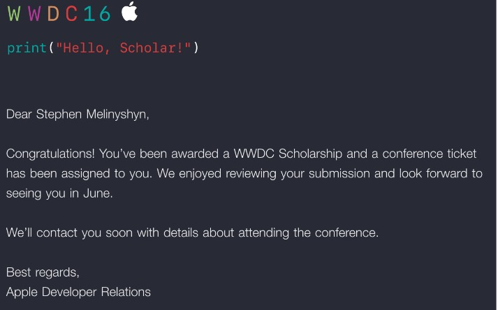

# WWDC 2016 Student App Submission

This is my winning submission for a [WWDC Student Scholarship](https://developer.apple.com/wwdc/scholarships/). As you can see in the demo gif below, I built upon my [WWDC 2015 app](https://github.com/Melinysh/WWDC-2015-Student-App) this year. You can read about my time at WWDC 2016 in [this blog post](https://melinysh.me/wwdc,/apple,/swift,/scholarship/2016/07/17/wwdc-2016-experience.html). 

